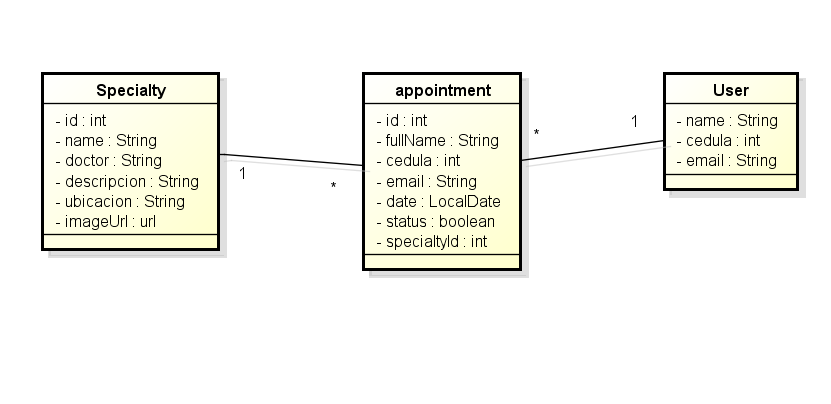
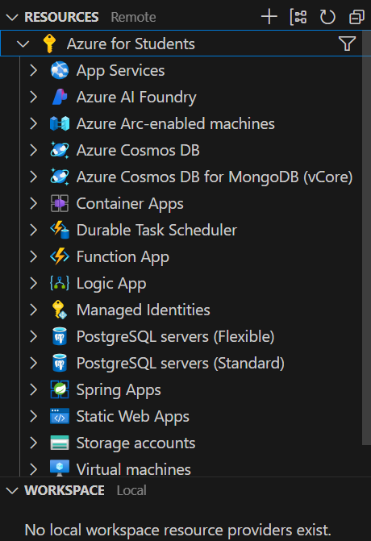
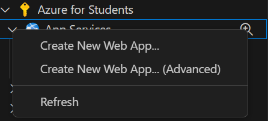
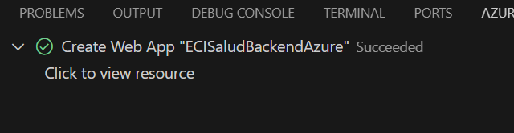
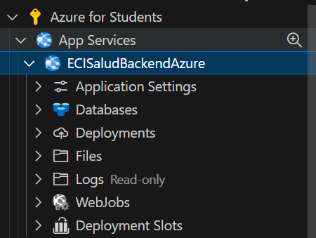
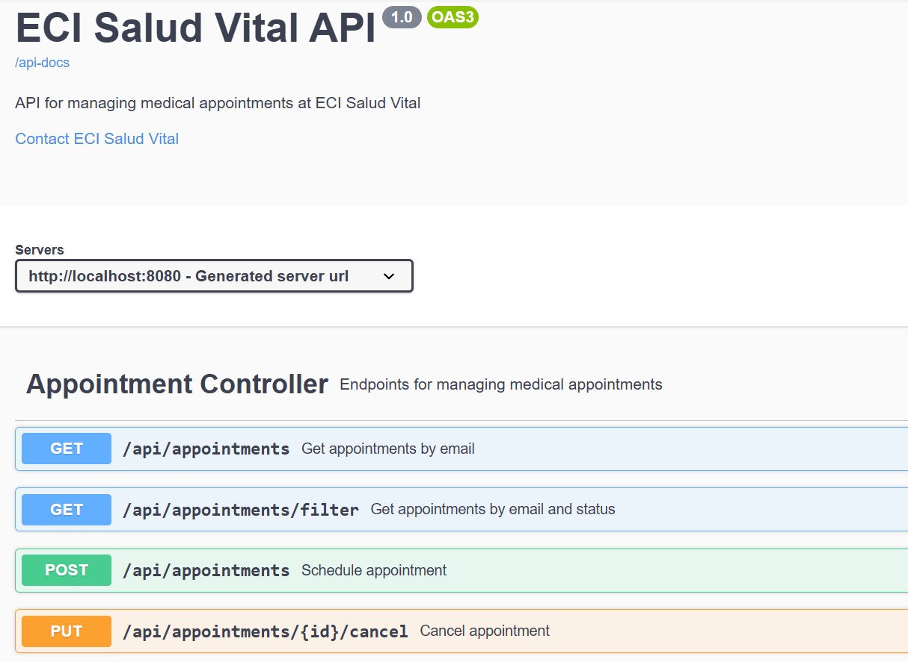
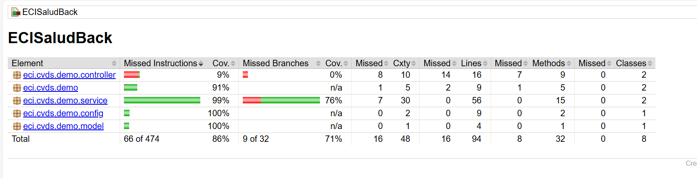

# ECI Salud Vital - Backend

## Estudiante
    Juan David Zambrano Gonzalez


## Arquitectura

### Diagrama de Componentes


### Diagrama de Clases





# Despliegue Backend en app services de Azure

    En este caso usamos la extencion de Azure en Visual Studio Code para crear un servicio de app de Azure y desplegar nuestro backend.



    Damos clic derecho en App services y seleccionamos la opción "Create New App"


    Hacemos la configuracion basica de nuestro servicio de app de Azure y se nos empezara a crear el servicio, esto lo podemos ver an la terminal
    

    Una vez creado el servicio de app de Azure, lo podemos ver en el costado izquierdo de la ventana de Visual Studio Code o en el portal de Azure
   

    Link despliegue en Azure: https://ecisaludbackendazure-bqhbbvekhvefa3d4.westeurope-01.azurewebsites.net/


## Endpoints

### Especialidades
- GET /api/specialties - Obtener todas las especialidades
- GET /api/specialties/{id} - Obtener una especialidad por ID
- POST /api/specialties/initialize - Inicializar especialidades por defecto

### Citas
- POST /api/appointments - Programar una nueva cita
- GET /api/appointments?email={email} - Obtener citas por email
- GET /api/appointments/filter?email={email}&status={status} - Filtrar citas por estado
- PUT /api/appointments/{id}/cancel - Cancelar una cita

## Swagger Documentation
Accede a la documentación Swagger en: http://localhost:8080/swagger-ui.html

## Instrucciones de Ejecución

1. Tener instalado:
   - Java 17
   - Maven
   - MongoDB


2. Ejecutar la aplicación:
```bash
mvn clean install
mvn spring-boot:run
```

4. La aplicación estará disponible en:
   - API: http://localhost:8080/api
   - Swagger: http://localhost:8080/swagger-ui/index.html

    

## Pruebas

### Cobertura de Pruebas usando JaCoCo


Para ejecutar las pruebas y generar el reporte de cobertura:
```bash
mvn clean test
```

El reporte de cobertura se generará en: `target/site/jacoco/index.html`




